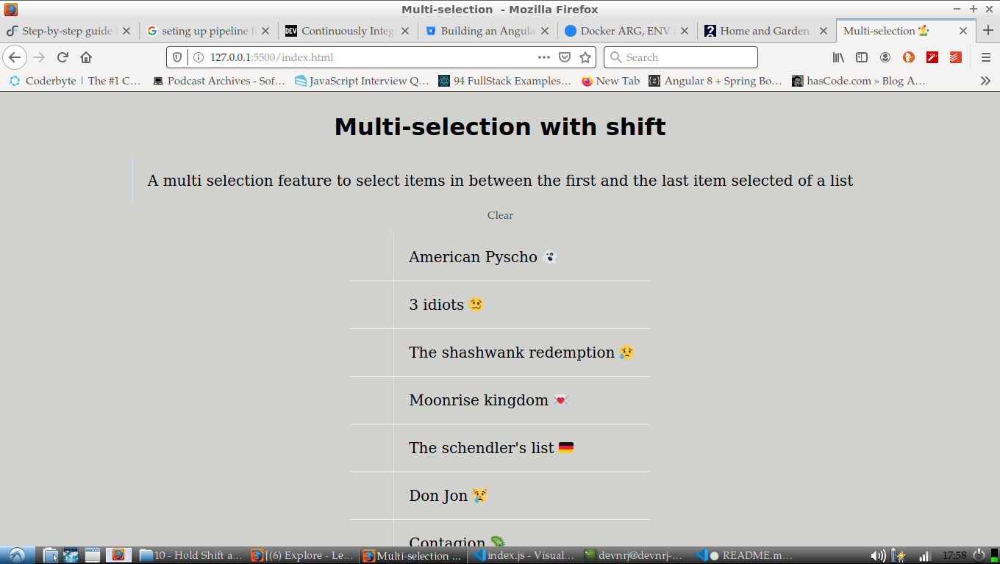

# Multi select with shift key

A common use case today is making it easy for user to auto select a bunch of consecutive items in a list, pressing ctrl could get overwhelmin sometimes. This is easy solution lets users to select multiple items between first and last selected items auto magically just pressing down simple `shift` key. This is all done using plain javascript.

# Challenges
- key events
- DOM
- CSS3 transistions

# demo 

