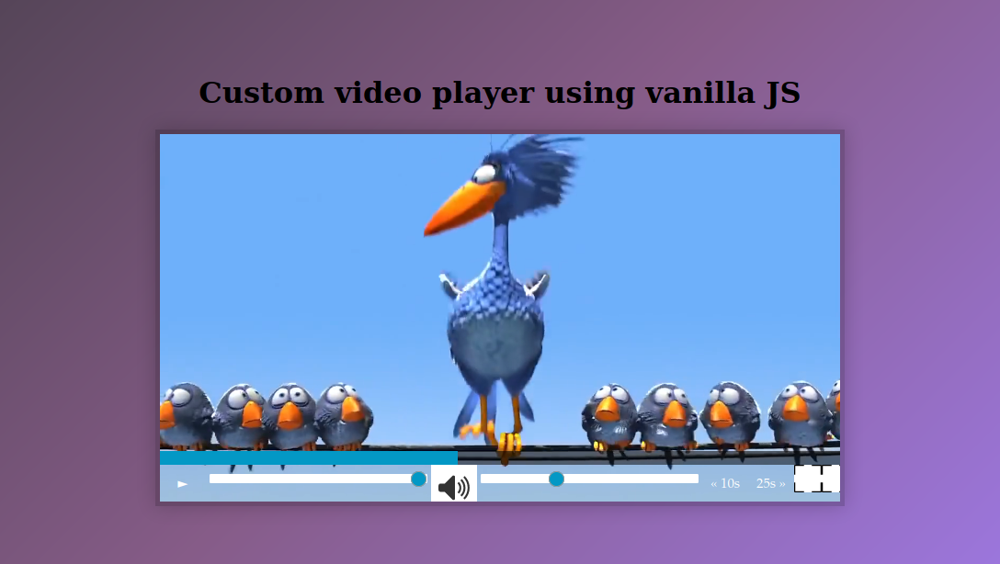

# Custom video player 

The default html video player has limited capabilities also its different for different browsers.
So, I decided built a custom one with some of the important features like `play pause` on click over the video, `volume control`, `playback control`, `full screen mode`, `skip`, `scrub` etc all this using plain javascript and css.

# Challenges
- video element
- video properties
- progress bar
- scrubbing
- skipping
- css

# demo

