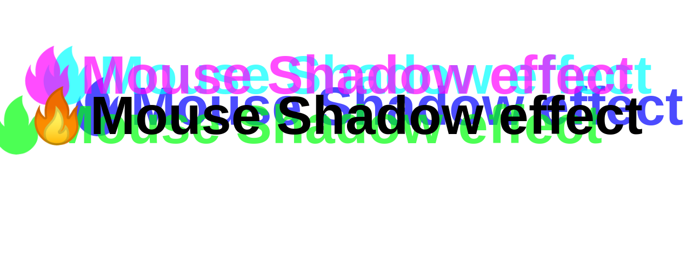

# Mouse Shadow Effect       

cool css effect using js. The idea is to capture the mouse movement within the div and update it to fall between certain range, and pass those values to `textshadow` css property to see the magic!

# Challenges
- elements offsetWidth, offsetHeight
- mouse offsetX, offsetY
- textshadow

# demo

