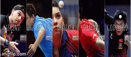

# Day 2: Flex Panel Gallery

A simple image gallery to showcase the power of flex in css. I added cool
transition effects. It has a nested flex box, all three text block are flex items with top and bottom moved out of the screen and comes back only on clicking. The image grows in size about x5 times on click, thanks to flex grow. Overall, fun way to express my understanding of flex and event `transitioned`

# Challenges
- flexbox layout
- image layouts
- css3 transitions
- javascript bind()

# Demo

{:class="img-responsive"}

