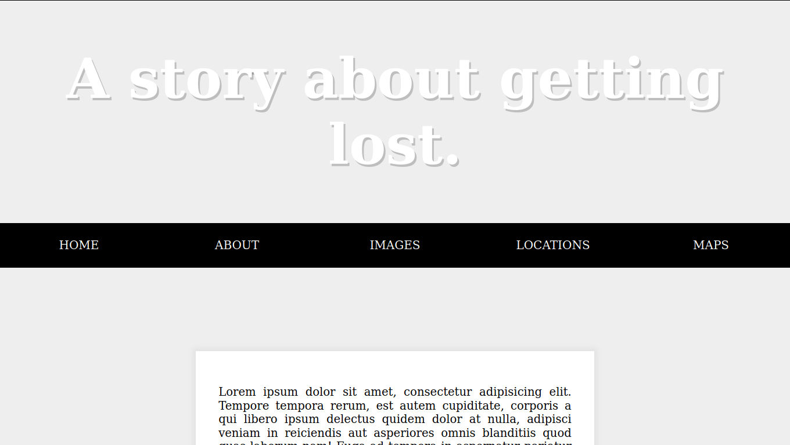
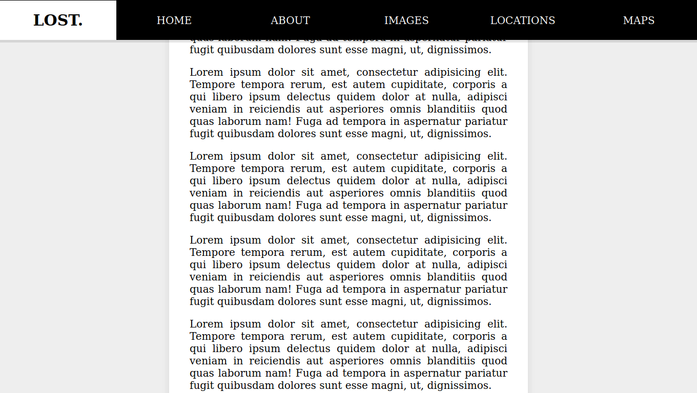

# Sticky navbar

Good old navbar sticking it up to the top of the page and letting it slide underneath without any break or text distortion using plain vanilla JS no Jquery no bootstrap

# Challenges
- offsetTop
- scrollY
- margin adjust
- transistion css property

# demo

- before scrolling

- after scrolling