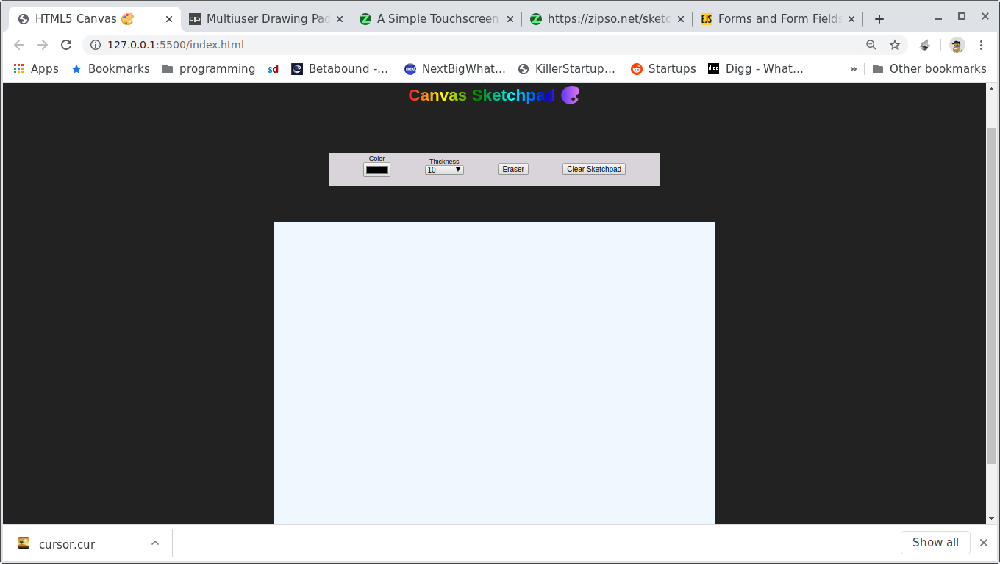
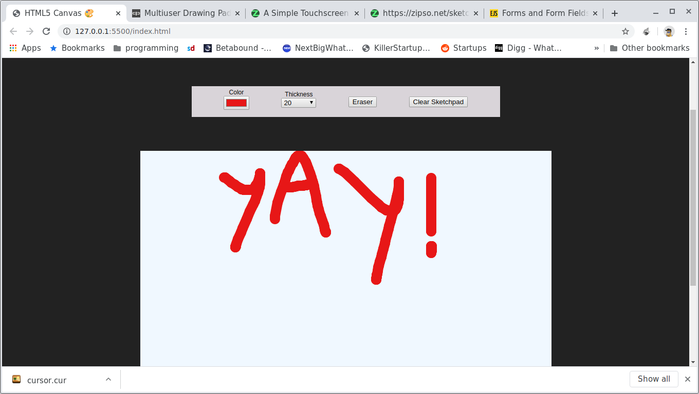
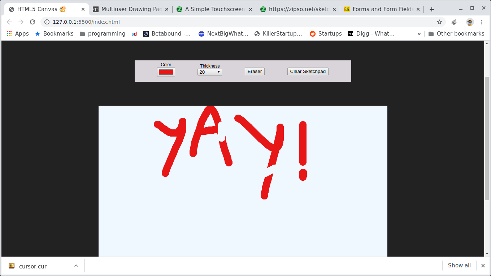

# Sketchpad 

Today, I decided to fiddle around with HTML5 canvas api. I tried to create a sketchpad like ms paint, with basic features like `color selection` , `brush thichkness`, `Eraser` all using vanilla javascript. I also added `touch` support using events like `touchstart`, `touchmove`. Although using a library like <a href=""> hammer.js </a> would have made things a lot easier but that would have been outside this challenge to build everything using vanillaJS.

# Challenges
- canvas api (setting height, width, stroke, color)
- reading input element values via js
- touch events (single touch)
- custom cursor

# screenshots

# code pen

<iframe height="265" style="width: 100%;" scrolling="no" title="HTML5 Sketchpad" src="https://codepen.io/neeraj-mukta/embed/RwWWBNw?height=265&theme-id=light&default-tab=js,result" frameborder="no" allowtransparency="true" allowfullscreen="true" loading="lazy">
  See the Pen <a href='https://codepen.io/neeraj-mukta/pen/RwWWBNw'>HTML5 Sketchpad</a> by Neeraj Mukta
  (<a href='https://codepen.io/neeraj-mukta'>@neeraj-mukta</a>) on <a href='https://codepen.io'>CodePen</a>.
</iframe>